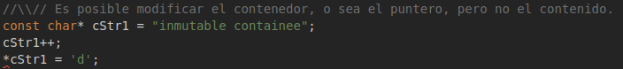
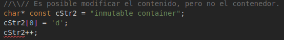
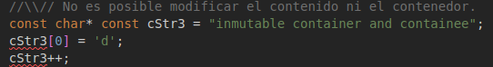

# Seminario 12. Características funcionales en lenguajes Multi-paradigmas

Integrantes:

**David Orlando De Quesada Oliva C311**

**Javier Domínguez C312**

**Daniel de la Cruz C311**


<div style="page-break-after: always; break-after: page;"></div>

#  C#

### a.**Funciones como ciudadanos de primer nivel en C#**

Cuando se habla del termino ciudadano de primera clase, se refiere a que es un valor que puede ser asignado a variables, pasado como parámetro o devuelto como resultado de una función. C# también tiene `delegates` que básicamente son tipos a los que se les puede asignar cualquier tipo de método que coincida con su declaración (parámetros, tipos de datos y valor de retorno) 

```c#
Func<int,int> square = (x) => {return x * x };
Func<A,C> Compose<A,B,C>(Func<A,B> f , Func<B,C> g)
{
    return x => g(f(x)); 
}
Func<string,int> f1 = (str) =>{
    return str == "first" ? 1 : 0; 
};
Func<int,bool> f2 = (x) => {
    return x == 1; 
};
var fComposed = Compose(f1,f2);
Console.WriteLine(fCompose("secund")); //false
```

En el ejemplo anterior la función `Compose` toma como parámetro dos funciones que toman un parámetro y regresan un valor. Regresa una función que toma un parámetro del tipo que recibe el primer parámetro y regresa un valor del tipo del valor de retorno del segundo parámetro. 

Usando delegates también se tiene un comportamiento con la misma funcionalidad que vimos anteriormente. 

```c#
public delegate void Del (string message);

public static void DelegateMethod (string message)
{
    System.Console.WriteLine(message);
}

Del handler = DelegateMethod; 

handler("Hello World");

// Hello World
```

#### Comparación con Haskell

En Haskell las funciones son cuidadanos de primera clase , es decir pueden ser asignadas a una varaible , pasarse como argumento a otra funcion y devolverse como resultado 

El siguiente ejemplo muestra como funciona esta caractersitica en un lenguaje funcional como Haskell. 

```haskell
mapfunction :: (a -> b) -> [a] -> [b]
mapfunction _ [] = []
mapfunction f (x:xs) = f x : mapfunction f xs
```

Entonces si definimos una funcion para llamar a la funcion anterior pasandole los parametors definidos entoces estariamos llamando a la funcion `mapfunction` con la funcion `cube` que definiremos a continuacion.

```
cube :: Num a => a -> a
cube x = x**2
```

La salida de nuestro programa seria la evaluacion de la funcion en la lista que se pasa como argumento. por lo tanto tendriamos el resultado siguiente: 

```
*Main> mapfunction cube [2,3,4]
[4,9,16]
```


### b.**List comprehension en C#** 

Una List Comprehension en C# es un tipo de notación en el que el programador puede describir las propiedades que los miembros de un conjunto debe reunir. Son usualmente usado para crear un conjunto basado en otro ya existente aplicando algún tipo de combinación. 

Con la aparición de C# 3.0 y de .Net Framework 3.5, apareció la notación *List Comprehension* basada en `Linkq` . El siguiente ejemplo muestra como formar un conjunto de números pares en el rango del 0 al 10.

```c#
IEnumerable<int> numbers = Enumerable.Range(0, 10);
var evens = from num in numbers where num % 2 == 0 select num;
```

Esto nos va a dar a retornar un objeto `evens` que es una lista que contiene a todos los números pares del 0 al 10  , `0 2 4 6 8 ` 

Las *querys expression* en C# 3 en adelante son azúcar sintáctica sobre la nomenclatura del código de C# normal. Aunque las expresiones de consultas generalmente terminan llamando a métodos de extencion (No tienen que hacerlo y al compilador no le importa, pero generalmente si). Hay varias cosas que se pueden hacer con las colecciones que no están disponibles en las expresiones de consulta de C#, pero son compatibles con las llamadas a métodos, por lo que vale la pena conocer ambos tipos de sintaxis.

```c#
List<Foo> fooList = new List<Foo>();
IEnumerable<string> extract = from foo in fooList where foo.Bar > 10 select foo.Name.ToUpper();
```

es preprocesado en: 

```c#
List<Foo> fooList = new List<Foo>();
IEnumerable<string> extract = fooList.Where(foo => foo.Bar > 10)
                                     .Select(foo => foo.Name.ToUpper());
```

Si se quieren hacer filtros basados en el indice del valor en la colección original se puede usar una sobrecarga apropiada de `Where` que no es posible en las *query expression*  

```c#
List<Foo> fooList = new List<Foo>();
IEnumerable<string> extract = fooList.Where((foo, index) => foo.Bar > 10 + index)
                                     .Select(foo => foo.Name.ToUpper());
```

Tambien existe `List<T>.ConvertAll` que se comporta igual que las *list Comprehension* realizando la misma operacion en cada elemento de una lista existente y luego devolviendo una nueva coleccion. Esta es una alternativa al uso de `Linq`, especialmente si se esta usando .NET 2.0 . En el ejemplo siguiente se muestra como usar esta con C# 3.0 pasando una función lambda especificando la función de mapeo que se necesita.  

```c#
var foo = new List<int> {1,2,3}; 
var bar = foo.ConvertAll (x => x * 2);  //list comprehension 
Console.WriteLine(string.Join(" ", bar)); // should print 2,4,6
```

Para C# 2.0, tu puedes usar un método anónimo con el `delegate`  `Convert`  para hacer algo parecido. 

```c#
List<int> foo = new List<int> (new int[]{1,2,3}); 
var bar = foo.ConvertAll(new Converter<int, int>(delegate (int x) { return x * 2; }));
Console.WriteLine(string.Join(" ", bar));
```

 Esto se puede aplicar no solo a listas , tambien se pueden usar `Arrays` usando `Array.ConvertAll` 

#### Comparación con haskell 

Haskell tiene List Comprehension para describir estas facilidades que brindan otros lenguajes también. Por ejemplo podemos hacer lo siguiente en Haskell 

```haskell
Prelude> [n | n <- [2..5] , n `mod` 2 == 0]
[2,4]
```

Aquí obtendríamos los números pares que están entre el 2 y el 5, la forma de hacerlo es bastante sencilla, lo que nos da la facilidad de una expresividad mayor con pocas lineas de código. Este comportamiento se obtiene en C# usando querys o algunas otras particularidades que existen en C# para esto. En haskell también podríamos hacer algo como lo siguiente: 

```haskell
primos :: Int -> [Int] 
primos n = [ x | x <- [2..n] , esPrimo x]
```

Si nos damos cuenta es la misma sintaxis que en el ejemplo de arriba solo que aquí queríamos resaltar que `esPrimo ` es una función previamente declarada , por lo tanto podemos complejizar la sentencia tanto como se quiera. 

### c.**Capacidades de pattern matching en C#**

Pattern matching en C# proporciona una sintaxis mas concisa para probar expresiones y tomar medidas cuando una expresión coincide. La expresión `is` admite pattern matching para probar una expresión y declarar condicionalmente una nueva variable al resultado de esa  expresión. La expresión `switch` permite realizar acciones basadas en el primer patrón coincidente de una expresión. Estas dos expresiones brindan un rico vocabulario de patrones.

##### Null Checks 

Uno de los escenarios mas comunes de los pattern matching es verificar que los valores no son `null`.  Tu puedes chequear y convertir un tipo que acepta valores `null` en su tipo subyacente mientras prueba el valor nulo 

```c#
int? maybe = 12;

if (maybe is int number)
{
    Console.WriteLine($"The nullable int 'maybe' has the value {number}");
}
else
{
    Console.WriteLine("The nullable int 'maybe' doesn't hold a value");
}
```

El código de arriba es un *declaration pattern* para chequear el tipo de la variable y asigna este a una nueva variable. La variable `number`  es solo accesible en el bloque `if` , si se trata de acceder  a esta variable en el bloque `else` o después del `if` este va a generar un error en tiempo de compilación. Debido a que no esta usando el operador `==`, este patrón funciona cuando un tipo sobrecarga el operador `==`. Eso lo convierte en una forma ideal de verificar valores de referencia nulos, agregando el patrón `not`.

```c#
string? message = "This is not the null string";

if (message is not null)
{
    Console.WriteLine(message);
}
```

El `not` es un patrón lógico que retorna verdadero cuando el cuando el patrón negado no machea.


##### Type tests 

Otro uso común de *pattern matching* es chequear una variable para ver de que tipo es. El siguiente ejemplo chequea si una variable no es `null` e implementa la interfaz `IList<T>`. Si la implementa esta usa la propiedad `Count`  de `ICollection<T>` para encontrar el indice medio.  El  *pattern matching* no coincide con un valor nulo, independientemente del tipo en tiempo de compilación de la variable. El código siguiente protege contra `null`, ademas de protegerse contra un tipo que no implementa `IList` 


```c#
public static T MidPoint<T>(IEnumerable<T> sequence)
{
    if (sequence is IList<T> list)
    {
        return list[list.Count / 2];
    }
    else if (sequence is null)
    {
        throw new ArgumentNullException(nameof(sequence), "Sequence can't be null.");
    }
    else
    {
        int halfLength = sequence.Count() / 2 - 1;
        if (halfLength < 0) halfLength = 0;
        return sequence.Skip(halfLength).First();
    }
}
```

Lo mismo se puede aplicar en una expresión `switch`  para comprobar que con múltiples tipos diferentes. 


##### Compare discrete values 

También se puede chequear una variable para encontrar si machea con un valor especifico. El siguiente código muestra un ejemplo donde se chequea un valor a través de todos los posibles valores declarados en una enumeración. 

```c#
public State PerformOperation(Operation command) =>
   command switch
   {
       Operation.SystemTest => RunDiagnostics(),
       Operation.Start => StartSystem(),
       Operation.Stop => StopSystem(),
       Operation.Reset => ResetToReady(),
       _ => throw new ArgumentException("Invalid enum value for command", nameof(command)),
   };
```

El ejemplo anterior muestra un método de envió basado en el valor de una enumeración. El caso final `_` es un `discard pattern` que machea todos los valores. Este  maneja cualquier error en la condicion donde el valor no machea con ninguno de los valores del `enum`.  Si se omite esa parte del bloque `switch` el compilador avisara que no se  puede manajar una respuesta para todas la posibles entradas.  En tiempo de ejecucion la expresion `switch` lanza una excepcion si el objeto que se examina no coincide con ninguno de los casos del `switch`. Se podria usar constantes numericas en lugar de de un conjunto de valores `enum` . Se puede usar tecnicas similares para valores de constantes de string que representan el comando 

```c#
public State PerformOperation(string command) =>
   command switch
   {
       "SystemTest" => RunDiagnostics(),
       "Start" => StartSystem(),
       "Stop" => StopSystem(),
       "Reset" => ResetToReady(),
       _ => throw new ArgumentException("Invalid string value for command", nameof(command)),
   };
```

 El ejemplo anterior muestra el mismo algoritmo pero usando valores string en lugar de un `enum` . En todos esos ejemplos *discard pattern* asegura que se cubren todas las entradas posibles.  El compilador asegura que cada posible entrada es manejada. 


##### Relational patterns 

Tu puedes usar *relational patterns* para probar como se compara un valor con las constantes.  Por ejemplo el siguiente codigo retorna el estado del agua basada en la temperatura en Fahrenheit: 

```c#
string WaterState(int tempInFahrenheit) =>
    tempInFahrenheit switch
    {
        (> 32) and (< 212) => "liquid",
        < 32 => "solid",
        > 212 => "gas",
        32 => "solid/liquid transition",
        212 => "liquid / gas transition",
    };
```

 El código anterior también muestra el *logical pattern* `and` para chequear que ambas condicionales se complen . Las dos sentecias  finales del `switch` dan salida a las dos posibles entradas que quedaban por asignar. Sin esas dos asignaciones el compilador avisaria que tu logica no cubre todas las entradas posibles. 

El código anterior también muestra otra importante característica que provee el compilador para las expresiones de *pattern matching*: El compilador te avisa si no se tratan todos los casos para todas las posibles entradas. Otra forma de de escribir la misma expresion puede ser: 

```c#
string WaterState2(int tempInFahrenheit) =>
    tempInFahrenheit switch
    {
        < 32 => "solid",
        32 => "solid/liquid transition",
        < 212 => "liquid",
        212 => "liquid / gas transition",
        _ => "gas",
};
```

La importancia de que el compilador valida si a todas las posibles entradas son procesadas radica en posibles Excepciones del programa, refractorizacion y reordenamiento del código. 

##### Multiple inputs 

Se pueden escribir patrones que examinan múltiples  propiedades de un objeto. Considera el siguiente *Order* `record` 

```c#
public record Order (int Item, decimal Cost); 
```

El siguiente código examina el numero de artículos y el valor de pedido para calcular un precio con descuento: 

```c#
public decimal CalculateDiscount(Order order) =>
    order switch
    {
        (Items: > 10, Cost: > 1000.00m) => 0.10m,
        (Items: > 5, Cost: > 500.00m) => 0.05m,
        Order { Cost: > 250.00m } => 0.02m,
        null => throw new ArgumentNullException(nameof(order), "Can't calculate discount on null order"),
        var someObject => 0m,
    };
```

Los primeros dos casos examinan dos propiedades del Order. La tercera examina solo el costo, la siguiente chequean el `null` y el final machea cualquier otra valor. Si el tipo Order define un método apropiado `Decontruct` tu puedes omitir la propiedad llamada del patrón y usar la deconstruccion para examinar las propiedades: 

```c#
public decimal CalculateDiscount(Order order) =>
    order switch
    {
        ( > 10,  > 1000.00m) => 0.10m,
        ( > 5, > 50.00m) => 0.05m,
        Order { Cost: > 250.00m } => 0.02m,
        null => throw new ArgumentNullException(nameof(order), "Can't calculate discount on null order"),
        var someObject => 0m,
    };
```

El codigo anterior muestra la *positional pattern* donde las propiedades son decontruidas por la expersion 


### d.**Inferencia de Tipos en C#** 

La inferencia de tipos es un proceso por el cual el compilador determina el tipo de una variable local que ha sido declarada sin una declaración explicita de su tipo. El tipo es inferido a partir del valor inicial provisto a la variable. Para que el algoritmo de inferencia de tipos funciones es necesaria una entrada, que es el contenido de la variable. Si no inicializamos la variable a inferir tendremos un error de compilación. La inferencia de tipos en C# se puede implementar haciendo uso de la palabra reservada `var` . la sintaxis para declarar una variable haciendo uso de la inferencia de tipos seria así: 

```c#
var x = new ArrayList(); 
```

en este caso el compilador determino que la variable `x` es del tipo `ArrayList` , pese a que en ningún momento se ha declarado su tipo explícitamente. 

La inferencia de tipos por valor generaliza al tipo mas implícito y optimizado del .Net Framework. Como el framework optimiza la performance para tipos enteros de 32-bits (System.Int32 y System.UInt32) un valor de 0,10 o de 100 que perfectamente podrían inferirse como `System.Byte` se infiere como system.Int32. Incluso se recomienda usar los tipos enteros para controladores (aunque contemos del 0 al 10) y variables enteras de acceso frecuente, ya que la performance en tiempo de ejecución del tipo entero es preferible al storage en RAM que ahorramos si declaramos variables como `System.SByte`, `System.Byte` y `System.Int16`. De la misma manera, con valores de punto flotante si declaramos una variable con un valor de 3.14 sera inferida al tipo `System.Double` y no como System.Single(float) que perfectamente se la puede contener. La razón es que las operaciones con System.Double son optimizadas por hardware. Solo se infiere a un tipo no optimizado por el Framework(como System.Int64 o System.Decimal)  si el valor de la variable esta fuera del rango de los tipos optimizados. Si por ejemplo queremos que se infiera el valor 3.14 como float en vez de double, debemos proporcionar cierta evidencia que ayude al compilador a inferirlo como float. 

``` c#
var inferredType = (float)3.14  // casting explicito 
var inferredType = 3.14f        // notacion sufijo 
```

Entonces resumiendo la inferencia de tipos no se resuelve utilizando mecanismo de código dinámico, que afecten la performance en tiempo de ejecución. La inferencia de tipos se resuelve en tiempo de compilación, por lo tanto existe un costo en tiempo de compilación, ese tiempo es el tiempo que tarda el algoritmo de inferencia en sintetizar una expresión y resolver el tipo de una variable.  La inferencia de tipos tanto de valor como de referencia es para variable locales de métodos. No se aplica para variables de clases, propiedades, parámetros ni valores de retorno. La inferencia de tipos no es mas que azúcar sintáctica, una manera cómoda y ágil de declarar variables locales.

#### Comparación con Haskell

En Haskell la inferencia de tipo es por defecto , es decir no existe un keyword especial para este proposito. Por ejemplo podemos definir una fucnion sin especificar tipo , pero el compilador determianara que tipo de funcion es y el tipo del valor de retorno: 

```
producto list = product list 
```

`product` es una función en Haskell para encontrar el producto entre números , en este caso de arriba el compilador asume que la función `producto` recibe una lista de enteros y devuelve un entero , es decir `producto :: [Int] -> Int`

### e.**Tuplas en C#** 

Las tuplas se crea utilizando los tipos genéricos `Tuple<T1>`  - `Tuple<T1,T2,T3,T4,T5,T6,T7,T8>`. Cada uno de los tipos representa una tupla que contiene de 1 a 8 elementos. Los tipos pueden ser de diferente tipos.

```c#
//tuple with 4 element
var tuple = new Tuple<string, int, bool, MyClass>("foo", 123, true, new MyClass());
```

Las tuplas también se pueden crear usando métodos estáticos de `Tuple.Create` .En este caso los tipos de los elementos son inferidos por el compilador de C#. 

```c#
// tuple with 4 elements
var tuple = Tuple.Create("foo", 123, true, new MyClass()); 
```

Desde C# 7.0 las tuplas se pueden crear facilmente usando  `ValueTuple`. 

```c#
var tuple = ("foo", 123, true, new MyClass()); 
```

Para acceder a los elementos de una tupla se utiliza `item1`- `item8` proopiedades. Solos las propiedades con numeros de indices menor o igual al tamano de las tupla estaran disponibles (es decir, no se puede acceder a las propiedad `Item3` en `Tuple<T1,T2>`). 

```c#
var tuple = new Tuple<string, int, bool, MyClass>("foo", 123, true, new MyClass());
var item1 = tuple.Item1; // "foo"
var item2 = tuple.Item2; // 123
var item3 = tuple.Item3; // true
var item4 = tuple.Item4; // new My Class()
```

Las tuplas se pueden comparar en función de sus elementos. Como ejemplo, un enumerable cuyos elementos son del tipo `Tuple` puede ordenarse en función de los operadores de comparación definidos en un elemento especifico: 

```c#
List<Tuple<int, string>> list = new List<Tuple<int, string>>();
list.Add(new Tuple<int, string>(2, "foo"));
list.Add(new Tuple<int, string>(1, "bar"));
list.Add(new Tuple<int, string>(3, "qux"));

list.Sort((a, b) => a.Item2.CompareTo(b.Item2)); //sort based on the string element

foreach (var element in list) {
    Console.WriteLine(element);
}

// Output
// (1, bar) 
// (2, foo) 
// (3, qux)
```

Las tuplas se pueden usar para devolver múltiples valores de un método sin usar parámetros. En el siguiente ejemplo, *AddMultiply* se usa para devolver dos valores(suma, producto). 

```c#
void Write()
{
    var result = AddMultiply(25, 28);
    Console.WriteLine(result.Item1);
    Console.WriteLine(result.Item2);
}

Tuple<int, int> AddMultiply(int a, int b)
{
    return new Tuple<int, int>(a + b, a * b);
}
// output:
// 53 
// 700
```

 Uno de los casos mas comunes de los usos de casos de las tuplas es como tipo de retorno de método. Es decir en lugar de definir los parámetros del método, puede agrupar los resultados del método en un tipo de retorno de tupla, como muestra el siguiente ejemplo: 

```c#
var xs = new [] {4,7,9};
var limits = FindMinMax(xs); 
Console.WriteLine($"Limits of [{string.Join(" ", xs)}] are {limits.min} and {limits.max}");
// Output:
// Limits of [4 7 9] are 4 and 9

var ys = new[] { -9, 0, 67, 100 };
var (minimum, maximum) = FindMinMax(ys);
Console.WriteLine($"Limits of [{string.Join(" ", ys)}] are {minimum} and {maximum}");
// Output:
// Limits of [-9 0 67 100] are -9 and 100

(int min , int max ) FindMinMax(int[] input)
{
    // ... code here
}
```

En el ejemplo anterior se puede ver como se puede trabajar con la tupla retornada directamente o desonstruyentdo esta en variables separadas. 

Se puede especificar explicitamente el nombre de cada uno de los campos de la inicialización de la tupla o la definición de el tipo de tupla, como se muestra en el siguiente ejemplo: 

```c#
var t = (Sum: 4.5, Count: 3);
Console.WriteLine($"Sum of {t.Count} elements is {t.Sum}.");

(double Sum, int Count) d = (4.5, 3);
Console.WriteLine($"Sum of {d.Count} elements is {d.Sum}.");
```

Con C# 7.1 si no se especifica el nombre de los campo, estos se van a inferir del nombre de la variable correspondiente en la expresión de inicialización de la tupla. como se muestra en la tupla siguiente: 

```c#
var sum = 4.5;
var count = 3;
var t = (sum, count);
Console.WriteLine($"Sum of {t.count} elements is {t.sum}.");
```

Eso se conoce como iniciadores de proyección de tuplas. El nombre de una variables no se proyecta en un nombre de campo de tuplas en los siguientes casos: 

 - el nombre del candidato es un nombre del miembro de un tipo de tupla, por ejemplo `Item3`, `ToString` o `Rest` 
 - el nombre del candidato es un duplicado de otro nombre de campo de tupla, ya sea explicito o implicito

En esos casos, especifica explicitamente el nombre de un campo o acceder a un campo por su nombre predeterminado. 

El nombre por defecto de los campos de las tuplas son `Item1`, `Item2`, `Item3` y así sucesivamente. Siempre se puede usar el nombre por defecto de un campo. Incluso cuando el nombre de un campo se especifica explícitamente o se infiere, como lo muestra el siguiente ejemplo: 

```c#
var a = 1;
var t = (a, b: 2, 3);
Console.WriteLine($"The 1st element is {t.Item1} (same as {t.a}).");
Console.WriteLine($"The 2nd element is {t.Item2} (same as {t.b}).");
Console.WriteLine($"The 3rd element is {t.Item3}.");
// Output:
// The 1st element is 1 (same as 1).
// The 2nd element is 2 (same as 2).
// The 3rd element is 3.
```

La asignación de tuplas y las comparaciones de igualdad de tuplas no tienen en cuenta los nombre de campos. En tiempo de compilación, el compilador remplaza los nombres de los campos que no son por defecto con los correspondientes nombres por defecto. Como resultado, los nombres de los campos explícitamente especificados o inferidos no están disponibles en tiempo de ejecución. 

C# soporta la asignación entre tipos de tuplas que satisfacen las dos condiciones siguientes: 

 - ambos tipos de tuplas tienen el mismo numero de elementos
 - por cada posición en la tupla, el tipo de la tupla de la derecha es el mismo o se puede convertir implícitamente al tipo que le corresponde al elemento de lado izquierdo

Los valores de los elementos de la tupla son asignados siguiendo el orden de los elementos de la tupla. El nombre de los campos de las tuplas son ignorados y no asignados, como se muestra en el siguiente ejemplo: 

```c#
(int, double) t1 = (17, 3.14);
(double First, double Second) t2 = (0.0, 1.0);
t2 = t1;
Console.WriteLine($"{nameof(t2)}: {t2.First} and {t2.Second}");
// Output:
// t2: 17 and 3.14

(double A, double B) t3 = (2.0, 3.0);
t3 = t2;
Console.WriteLine($"{nameof(t3)}: {t3.A} and {t3.B}");
// Output:
// t3: 17 and 3.14
```

Se puede usar el operador de asignación `=` para *deconstruir* la instancia de una tupla en variables separadas. Se puede hacer de una de las siguientes maneras.

 - Declarando explicitamente el tipo de cada variable dentro de parentesis: 

   ```c#
   var t = ("post office", 3.6);
   (string destination, double distance) = t;
   Console.WriteLine($"Distance to {destination} is {distance} kilometers.");
   // Output:
   // Distance to post office is 3.6 kilometers.
   ```

 - Usar la palabra reservada `var` fuera de los parentesis para declarar implicitamente los tipos de variables y dejar que le compilador infiera sus tipos. 

   ```c#
   var t = ("post office", 3.6);
   var (destination, distance) = t;
   Console.WriteLine($"Distance to {destination} is {distance} kilometers.");
   // Output:
   // Distance to post office is 3.6 kilometers.
   ```

 - Usar variables existentes: 

   ```c#
   var destination = string.Empty;
   var distance = 0.0;
   
   var t = ("post office", 3.6);
   (destination, distance) = t;
   Console.WriteLine($"Distance to {destination} is {distance} kilometers.");
   // Output:
   // Distance to post office is 3.6 kilometers.
   ```

La igualdad entre tuplas con C# 7.3, los tipos de tuplas soportan los operadores de `==` y `!=` Esos operadores comparan los miembros del lado izquierdo del operador con los miembros correspondientes del lado derecho del operador siguiendo el orden de los elementos de la tupla. 

```c#
(int a, byte b) left = (5, 10);
(long a, int b) right = (5, 10);
Console.WriteLine(left == right);  // output: True
Console.WriteLine(left != right);  // output: False

var t1 = (A: 5, B: 10);
var t2 = (B: 5, A: 10);
Console.WriteLine(t1 == t2);  // output: True
Console.WriteLine(t1 != t2);  // output: False
```

En el ejemplo anterior se muestra, las operaciones `==` y `!=` no tienen en cuenta los nombres de los campos de las tupas. 

Dos tuplas son comparables cuando cuando cumplen las dos condiciones siguientes: 

 - Ambas tuplas tienen el numero de elementos. 
 - Por cada posiciones de la tupla, los elementos correspondientes de la parte izquierda y de la parte derecha de operador son comparables con los operadores `==` y `!=` 

Típicamente, se factoriza un método que tiene parámetros `out` dentro de un método que retorna una tupla. Sin embargo hay casos en que un parámetro `out`  puede ser de un tipo tupla. Los ejemplos siguientes muestran como trabajar con tuplas como parametros`out`.

```c#
var limitsLookup = new Dictionary<int, (int Min, int Max)>()
{
    [2] = (4, 10),
    [4] = (10, 20),
    [6] = (0, 23)
};

if (limitsLookup.TryGetValue(4, out (int Min, int Max) limits))
{
    Console.WriteLine($"Found limits: min is {limits.Min}, max is {limits.Max}");
}
// Output:
// Found limits: min is 10, max is 20
```

#### Comparación con Haskell 

En Haskell es bastante parecido a C# , la sintaxis es basntante parecida , las tupla son representadas con parentesis y los elementos son separados por `,` .Ejemplo

```haskell
Prelude> let tuple = (1,2,3)
Prelude> tuple
(1,2,3)
Prelude> :t tuple
tuple :: (Num a, Num b, Num c) => (a, b, c)
```

Los elementos de las tuplas pueden ser de dstinto tipo , como sucede en C#, ejemplo : 

```haskell
Prelude> let tuple = ("perro" , 4 , True)
Prelude> tuple
("perro",4,True)
```

Las tuplas pueden ser usadas  como valores de retorno en la función, para poder encapsular mas de una elemento el el retorno de una función, como se practica en C# tambien. 


### f.**Redefinición de operadores en C#** 

Un tipo definido por el programador puede sobrecargar un operador de C# predefinido. Un tipo puede proporcionar la implementacion personalizada de una operación cuando uno o los dos operandos son de ese tipo. 

Para sobrecargar un operador se usa la palabla clave `operator` . Una declaración de operador debe cumplir con la siguiente reglas: 

 - Incluir los modificadores`public` y  `static`  
 - Un operador unitario tiene un parámetro de entrada. Un operador binario tiene dos parametros de entrada. En cada caso, al menos un parámetro debe ser de tipo `T` o `T?` donde `T` es el tipo que contiene la declaración del operador.

En el ejemplo siguiente se muestra una estructura simplificada para representar un numero racional. La estructura sobrecarga alguno de los operadores aritmético: 

```c#
using System;

public readonly struct Fraction
{
    private readonly int num;
    private readonly int den;

    public Fraction(int numerator, int denominator)
    {
        if (denominator == 0)
        {
            throw new ArgumentException("Denominator cannot be zero.", nameof(denominator));
        }
        num = numerator;
        den = denominator;
    }

    public static Fraction operator +(Fraction a) => a;
    public static Fraction operator -(Fraction a) => new Fraction(-a.num, a.den);

    public static Fraction operator +(Fraction a, Fraction b)
        => new Fraction(a.num * b.den + b.num * a.den, a.den * b.den);

    public static Fraction operator -(Fraction a, Fraction b)
        => a + (-b);

    public static Fraction operator *(Fraction a, Fraction b)
        => new Fraction(a.num * b.num, a.den * b.den);

    public static Fraction operator /(Fraction a, Fraction b)
    {
        if (b.num == 0)
        {
            throw new DivideByZeroException();
        }
        return new Fraction(a.num * b.den, a.den * b.num);
    }

    public override string ToString() => $"{num} / {den}";
}

public static class OperatorOverloading
{
    public static void Main()
    {
        var a = new Fraction(5, 4);
        var b = new Fraction(1, 2);
        Console.WriteLine(-a);   // output: -5 / 4
        Console.WriteLine(a + b);  // output: 14 / 8
        Console.WriteLine(a - b);  // output: 6 / 8
        Console.WriteLine(a * b);  // output: 5 / 8
        Console.WriteLine(a / b);  // output: 10 / 4
    }
}
```


#### Posibilidades de sobrecarga en C# 

La tabla siguiente muestra las posibilidades de sobrecarga de los operadores en C# 

| Operadores                                                   | Posibilida de sobrecarga                                     |
| ------------------------------------------------------------ | ------------------------------------------------------------ |
| `+x`, `-x`, `!x`, `~x`, `++`, `--`, `true`, `false`          | Estos operadores unarios se pueden sobrecargar               |
| `x + y`, `x-y`, `x * y`, `x / y`, `x % y`, `x & y`, `x ^ y`, `x << y`, `x >> y`, `x == y`, `x != y`, `x < y`, `x > y`, `x <= y`, `x >= y`, `x|y` | No se pueden sobrecargar los operadores lógicos condicionales, si un tipo con los operadores `true` o `false` sobrecargados, también sobrecarga al operador `&` o `|` de determinada manera, el operador `&&` o `||`, respectivamente, se puede evaluar para los operadores de este tipo. |
| `a[i]` , `a?[i]`                                             | El acceso a un elemento no se considera un operador sobrecargable, pero puede definir un indexador. |
| `(T)x`                                                       | No se puede convertir el operador de conversión, pero puede definirse conversiones de tipos personalizadas que pueden realizarse mediante una expresión de conversión |
| `+=`, `-=`, `*=`, `/=`, `%=`, `&=` ,`^=`, `<<=`, `>>=` , `|=` | Los operadores de asignación compuestos no pueden sobrecargarse explícitamente. Pero cuando se sobrecarga un operador binario, el operador de asignación compuesto correspondiente , si lo hay, también se puede sobrecargar de modo implícito. Por ejemplo `+= `se evalúa con `+` , que se pueden sobrecargar. |
| `^x`, `x = y`, `x.y`, `x?.y`, `c ? t : f`, `x ?? y`, `x ??= y`, `x..y`, `x->y`, `=>`, `f(x)`, `as`, `await`, `checked`, `unchecked`, `default`, `delegate`, `is`, `nameof`, `new`,`sizeof`, `stackalloc`, `switch`, `typeof`,`with` | Estos operadores no se pueden sobrecargar                    |

#### Comparación con Haskell 

La sobrecarga en Haskell esta diponible utilizando clase de tipo . Por ejemplo para sobrecargar `+` , como `+` pertenece a `Num` por lo que habria qu eproporcionar una clase de tipo `Num` para su tipo. 

Se podria definir un nuevo operador por ejemplo: 

```haskell
data Pair a b = Pair a b
	deriving Show 
infixl 6 |+| -- optional; set same precedence and associativity as + 
Pair a b |+| Pair c d = Pair (a+c) (b+d)
```

Y si lo ejecutamos tendriamos el comportamiento deseado: 

```haskell
> Pair 2 4 |+| Pair 1 2 
Pair 3 6
```


### g.**Inmutabilidad en C#** 

Los tipos inmutables son esos que sus datos no pueden ser alterados después de que se crea la instancia. En tipos inmutables se crea en una nuevo espacio de memoria y los valores modificados son guardados en una nueva memoria. 

En C# los `string` son inmutables, que significa que se crea una nueva memoria cada vez que se altera el objeto, en vez de trabajar en el espacio de memoria donde ya existe la memoria. Esto se traduce en que cada vez que tratamos de modificar un string, un nuevo objeto va a ser referenciado donde va a estar el nuevo string y el espacio de memoria donde estaba el objeto anteriormente va a ser desreferenciado. Entonce si modificamos un string constantemente el numero de desreferenciacio a viejos objetos se incrementara y este proceso va a tener que esperar por el recolector de basura para liberar los espacios de memoria que han sido desreferenciados y la aplicación va disminuir su rendimiento.    

```c#
string str = string.Empty
for (int i = 0; i < 1000 ; i++)
{
    str += "string "
}
```

En el código de arriba `str` va a ser actualizado 1000 veces dentro de un ciclo y cada vez que se ejecuta el ciclo se crean nuevas instancias , entonces las valores antiguos vas a ser tratados por el recolector de basura después de algún tiempo. 

No es una buena practica la solución anterior, es mejor usar tipos mutables. En C# existen `StringBuilder` que es un tipo mutable. Esto significa que  siempre se usa la misma dirección de memoria para alterar el objeto, es decir se trabaja sobre la misma instancia, esto no va a crear ninguna instancia futura por lo tanto no va a disminuir el rendimiento de nuestra aplicación. 

```c#
StringBuilder = strB = new StringBuilder(); 
for (int i =0; i < 10000; i++)
{
    strB.Append("Modified "); 
}
```

 En el código anterior, no tiene un impacto grande sobre la memoria porque este no crea instancia cada vez que se ejecuta el cuerpo del ciclo. 

Para crear clases inmutables en C# , tenemos que pensar si sus propiedades o variables no van a cambiar nunca sus valores después que sean asignados la primera vez. 

Haciendo la variable de solo lectura tal que no se pueda modificar la variable después que se asigne la primera vez. Ejemplo: 

```c#
class MyClass
{
    private readonly string myStr;
    
    public MyClass(string str)
    {
        myStr = str;
    }
    
    public string GetStr
    {
        get {return myStr;}
    }
}
```

En el código anterior se tiene un campo de solo lectura que es inicializado a través del constructor de la clase. De esta manera se pueden crear la clases inmutables en C#

En C# existe el `namespace` , `System.Collections.Inmmutable` que contiene  colecciones inmutables. Contiene inmutables versiones de `List`, `Dictionaries`, `Arrays` , `Hashes` `Stacks` y `Queues`  

Por ejemplo `ImmutableStack<T>` puede ser usando para pushear y extraer elementos de la pila de la misma manera en que se hace con la implementaciones mutables de `Stack<T>` sin embargo `ImmutableStack<T>` es una colección inmutable, sus elementos no pueden ser alterados. Entonces cuando se hace una llamada a `pop`  para extraer un elemento de la pila, una nueva pila es creada y la pila original permanece inalterada.

Vamos a ver el siguiente ejemplo, en este caso vamos a ver como se pueden pushear elementos dentro de una pila inmutable. 

```c#
var stack = ImmutableStack<int>.Empty;
for(int i = 0; i < 10; i++)
{
    stack = stack.Push(i);
}
```

El código siguiente muestra que los elementos de una pila inmutable no pueden ser alterado. 

```c#
var stack = ImmutableStack<int>.Empty;
for(int i = 0; i < 10; i++)
{
	stack = stack.Push(i);
}
Console.WriteLine("No of elements in original stack:" + stack.Count());
var newStack = stack.Pop();
Console.WriteLine("No of elements in new stack: " + newStack.Count());
Console.ReadKey();

// No of elements in original stack: 10
// No of elements in new stack: 9
```

Como se puede ver en el resultado anterior  la pila inmutable original (contiene 10 elementos) no ha cambiado después de la llamada al método `pop()`. En cambio una nueva pila inmutables es creada con 9 elementos  

Las colecciones inmutables no tiene constructor pero se puede usar el método estático `Create` como se muestra en el código a continuación:

```c#
var list = ImmutableList.Create(1,2,3,4,5);
```

Si se quiere añadir o eliminar un elemento de esta colección, una nueva lista inmutable sera creada  y la lista original permanecerá igual.s


#   Python


### a.**Funciones como ciudadanos de primer nivel en Python**


El concepto funciones como ciudadanos de primera clase manda que las funciones son tratados como ciudadanos de primera clase: almacenadas en variables o es una estructura de datos, pasadas o devueltas como variables por una función.
Se dice que en un lenguaje las funciones son de primera clase (o que son "objetos de primera clase") cuando se pueden tratar como cualquier otro valor del lenguaje, es decir, cuando se pueden almacenar en variables, pasar como parámetro y devolver desde funciones, sin ningún tratamiento especial. 
Funciones de primera clase: si una función se puede asignar a una variable o pasar como objeto/variable a otra función, esa función se llama como función de primera clase.

Las funciones como ciudadanos de primera ninvel significan que puedes pasar funciones como otros objetos. Eso significa que puede asignar funciones a variables, puede pasarlas como argumentos, puede almacenarlas en estructuras de datos más grandes, definirlas dentro de otra función y también devolverlas desde otra función, como cualquier otro objeto. 
Esto se logra en Python porque las funciones no son más que objetos. Tiene tantos parámetros / métodos los cuales puedes  inspeccionar usando el método dir ().
Entonces las funciones en Python son objects de tipo.

Veamos las ventajas de que las funciones sean objetos.

**Asignar funciones a variables:**

Digamos que defino un método greet como este:
```Python
def greet(name):
    print("Hello " + name)

greet("World")                ## => "Hello World"
greet("Universe")                ## => "Hello Universe"
```

Pero como _greet_ es un objeto de tipo función, puedo asignarlo a una variable  a la que llamo _say_hello_:
```Python
say_hello = greet
```
Ahora _say_hello_ es un objeto de tipo función, lo que significa que puedo llamarlo como _greet_:

```Python
say_hello("Earth")                         ## => "Hello Earth"
say_hello("Mars")                         ## => "Hello Mars"
```

Esto se puede hacer debido a que las funciones son ciudadanos de primera clase(first class citizens).


**Pasando funciones comom argumentos:**

En Python puedes pasar funciones como argumentos de otras funciones

Supongamos que tenemos una función _call_func_ que se define :

```Python
def call_func(x, func):
    """recieve a function and execute it and return result"""
    return func(x)

```
_call_func_ es una función que solo devuelve el valor de _func(x)_


Definamos dos funciones simples :
```Python
def square(x): return x * x
def cube(x): return x * x * x
```

Ahora pasemos estas funciones a _call_func_ 

```Python
res = call_func(6, do_square)   # passing function to another function
print(res)
res = call_func(5, do_cube)
print(res)
```
*Almacenando funciones en otras estructuras de datos:*

También puedes almacenar funciones en otras structuras de datos como listas, diccioarios, etc

Definamos una lista llamada _operations_ que almacene la función previamente definiada _square_ y _cube_:

```Python
operations = [square, cube]
```
Y luego vamos a llamar a estas funciones con los índices de la lista:

```Python
print(operations[0](3)) ##=> 9
print(operations[1](7)) ##=>343
```

### **Comparando con Haskell:**

En Haskell las funciones son  tratadas como ciudadanos de primera clase. Esto significa que las funciones pueden almacenarse en estructura de datos , pasarse como argumento a otras funciones y devolverse como resultado.

Ejemplo1:

La función mymap: toma como argumentos una función y una lista y devuelve como resultado la
lista que contiene la evaluación de la función en cada uno de los elementos de la lista de entrada.

```Haskell
mymap :: (a -> b) -> [a] -> [b]
mymap _ [] = []
mymap f (x:xs) = f x : mymap f xs
```

Definamos otra función sencilla para probabr mymapp:
```
doble :: Num a => a -> a
doble x = x *2
```

```
*Main> mymap doble [1,2,3,4,5]
[2,4,6,8,10]
```

### b.**List comprehension en Python**

Uno de los aspectos más distintivos de Python son las list y las list comprehension feature, que pueden usarse en una línea de código construir funcionalidades poderosas.

Las list comprehension se utilizan para crear  nuevas listas a partir de otros iterables como tuplas, strings, lists,etc. 

**List comprehension Python Sintax:**

``` Python
newList = [ expression(element) for element in oldList if condition ] 
```

Ventajas de las List comprehension:
* Más eficiente en tiempo y espacio que los ciclos(loops)
* Requiere menos líneas de código
* Transforma una declaración iterativa en una fórmula

**List Comprehensions vs Ciclos For:**

Hay varias formas de recorrer una lista en Python. Sin embargo el enfoque más común es usar el ciclo for.

Veamos el siguiente ejemplo:

```Python
# Lista vacía
List = []
 
# Enfoque tradicional al iterar
for c in 'ComputerScience':
    List.append(c)
 
# imprimir la lista
print(List)
```


Ouput:
```
['C', 'o', 'm', 'p', 'u', 't', 'e', 'r', 'S', 'c', 'i', 'e', 'n', 'c', 'e']

```
 Esta es la manera tradicional para iterar por una lista, tupla, string, etc en Python. Ahora con list comprehension podemos hacer la misma tarea y hacemos que el programa sea más simple.


 List comprehension traduce el enfoque de una interación tradicional usando for en una fórmula simple, lo que las hace fáciles de usar. A continuación se muestra el enfoque parar iterar a través de una lista, string, tupla, etc utilizando list comprehension.

```Python
 # usando list comprehension para iterar a través de un ciclo
List = [character for character in 'ComputerScience']
 
# imprime en patalla List
print(List)
```
Ouput:
```
['C', 'o', 'm', 'p', 'u', 't', 'e', 'r', 'S', 'c', 'i', 'e', 'n', 'c', 'e']

```

**Más ejemplos:**

Obtener una lista con los enteros que están en [0,10):
```Python
d = [x for x in range(10)]

print(d)
```

Output:
```Python
[0, 1, 2, 3, 4, 5, 6, 7, 8, 9]
```

Números pares hasta 100:
```Python
pares = [ x for x in range(100) if x%2 ==0]
print(pares)
```
Output:

```Python
[0, 2, 4, 6, 8, 10, 12, 14, 16, 18, 20, 22, 24, 26, 28, 30, 32, 34, 36, 38, 40, 42, 44, 46, 48, 50, 52, 54, 56, 58, 60, 62, 64, 66, 68, 70, 72, 74, 76, 78, 80, 82, 84, 86, 88, 90, 92, 94, 96, 98]
```

Las list comprehension son más eficientes tanto computacionalmente como en términos de espacio y tiempo de codificación que un ciclo for. Normalmente se escriben en una sola línea de código. 

El siguiente código muestra la diferencia entre ciclos for y list comprehension según el rendimiento:

```Python
import time
 
# definamos la función a implementar usando ciclo for  

def for_loop(n):
    result = []
    for i in range(n):
        result.append(i**2)
    return result
 
 
# definamos la función a implementar usando list comprehension
def list_comprehension(n):
    return [i**2 for i in range(n)]
 
 

 
# Calcular el tiempo que toma for_loop()
begin = time.time()
for_loop(10**6)
end = time.time()
 
# Mostrar el tiempo que tomó for_loop()
print('Time taken for_loop:',round(end-begin,2))
 
# Calcular el tiempo que toma lis_comprehension()
begin = time.time()
a = list_comprehension(10**6)
end = time.time()
 
# Mostrar el tiempo que tomó list_comprehension()
print('Time taken for list_comprehension:',round(end-begin,2))
```

Output:
```
Time taken for_loop: 0.26
Time taken for list_comprehension: 0.23
```
Se puede ver que las list comprehension son bastante más rápidas que los ciclos for.

**List comprehension anidadas:**

Las list comprehension anidadas no son más que una list comprehension dentro de otra list comprehension, bastante similar a los ciclos anidados.

A continuación un código con ciclos anidados:
```Python
#using nested for-loop

matrix = []
 
for i in range(3):
     
    # Append an empty sublist inside the list
    matrix.append([])
     
    for j in range(5):
        matrix[i].append(j)
         
print(matrix)
```

Output:
```
[[0, 1, 2, 3, 4], [0, 1, 2, 3, 4], [0, 1, 2, 3, 4]]
```

Si usamos list comprehesion anidadas se puede generar la misma salida menos líneas de código
```Python
# using nested list comprehension

matrix = [[j for j in range(5)] for i in range(3)]
 
print(matrix)
```
Output:
```
[[0, 1, 2, 3, 4], [0, 1, 2, 3, 4], [0, 1, 2, 3, 4]]
```
**List Comprehensions y Lambda:**

Las lambda expressions no son más que representaciones abreviadas de funciones en Python. Usar list comprehension con lambda expressions resulta una combinación bastante eficiente.

Por ejemplo:

Si queremos imprimir x * 10 si x es par y x * 5 si x es impar de 1 a 10:

```Python
n = [x() for x in [lambda x=x: x*10 if x%2 ==0 else x*5 for x in range(1, 11)]]
 
print(n)
```

Dada una cadena s devolver la lista de caracteres de esta en toggle case:

```Python
# toggle case

# Inicializar el  string
string = 'Python'

# Toggle case de cada caracter de entrada
toggle = lambda s: [chr(ord(c)^32) for c in s ]
# Imprimir la lista
print(toggle(string))
```

Output:
```
['p', 'Y', 'T', 'H', 'O', 'N']
```

**List Comprehension condicionales:**

También podemos agregar declaraciones condicionales a las list comprehension. Podemos crear una list usando range(), operadores etc, y aplicar algunas condiciones a la lista usand if statement.

*Ejemplo1:*

Mostrar el cuadrado de los números pares de 1 a 10:
```Python
# Obtener una lisa con los cuadrados de los números pares desde 1 hasta 10
squares = [n**2 for n in range(1, 11) if n%2==0]
 
# imprimir la list de cuadrados
print(squares)
```

*Output*:

```
[4, 16, 36, 64, 100]
```


**Más ejemplos de list comprehensions:**

Obtener la transpuesta de una matriz:

```Python

# assignar una matriz
matrix = [[10, 1, 3],
          [7,  5, 7],
          [11, 34, 13]]
 
# Transpuesta usando list comprehension
trans = [[i[j] for i in matrix] for j in range(len(matrix))]
 

for i in trans:
    print(i)
```
Output:
```
[10, 7, 11]
[1, 5, 34]
[3, 7, 13]
```

Puntos importantes de las list comprehension en Python:
* La list comprehension son un medio eficaz de describir y construir listas basadas en listas actuales
* Generalmente las list comprehension son una forma más liviana para crear listas que la forma estándar con funciones y ciclos.
* Cada list comprehension puede ser reescrita en un ciclo for, ero en el contexto de interpretación de listas, no se puede reescribir cada bucle for.

### **Comparación con Haskell:**

Haskell tiene una notación llamada list comprehension que es muy conveniente para describir ciertos tipos de listas. 
Las sintaxis básica de una list comprehension en Haskell es:
```
[expr | qualifier, qualifier, ...]
```
Genera una lista donde los elementos donde los elementos sean de la forma expr, de manera que los elementos cumplan las condiciones en los qualifiers.

`expression`: puede ser cualquier expresión válida de Haskell

`qualifiers`: puede tener 3 formas diferentes : `generators`, `filters`, `local definitions`


Generator Qualifiers:
Genera un número de elementos que se pueden usar en la parte de expression de la list comprehension.

Sintaxis:
```
pattern <- list_expr
```
Ejemplo1:
```
Prelude> [n|n<-[1..5]]
[1,2,3,4,5]
```

Ejemplo2:
```
Prelude> [(n,n*n) | n<-[1..3]]
[(1,1),(2,4),(3,9)]
```

**Filter Qualifiers:**

Un filter es una expresión booleana que remueve elementos que de otro modo se habrían incluido en la list comprehension. A menudo usamo un `generator` para para producir una secuencia de elementos y un `filter` para eliminar los elementos que no son necesarios.

Ejemplo1:

```
Prelude> [n*n | n<-[1..10], even n]
[4,16,36,64,100]
```
 Ejemplo2:
```
 Prelude> [(n,n*n) | n<-[1..3], n <n*n]
[(2,4),(3,9)]
```

**Local Definitions:**

Podemos definir una variable local dentro de la list comprehension

Ejemplo1:
```
Prelude> [n*n | let n = 2]
[4]
```

Ejemplo2:
```
Prelude> [k*n | k <- [5,10..50],let n = 2]
[10,20,30,40,50,60,70,80,90,100]
```

**Otros ejemlos de List comprehension en Haskell:**

```Haskell
triads :: (Num c, Eq c, Enum c) => c -> [(c, c, c)]
triads n = [ (x,y,z) | x <- [1..n], y <- [1..n], z <- [1..n], x^2 + y ^2 == z^2]
```

```
*Main> triads 5
[(3,4,5),(4,3,5)]
*Main> triads 10
[(3,4,5),(4,3,5),(6,8,10),(8,6,10)]
```

### c.**Capacidades de pattern matching en Python**


Antes de Python `3.10` no existía algo como los switch case en Python para hacer pattern matching. Se podía usar diccionarios para internar simular en algunos casos la correspondencia con algún patrón

**Structural Pattern Matching en Python 3.10:**

El structural pattern matching en Python puede ser usado como una simple declaración switch, pero es capaz de mucho más. 

Tomemos el caso simple switch case. A continuación se muestra un fragmento de código que hace switch en un solo valor. Probándolo con los valores en un ciclo 1, 2, 3, 4.

```Python
for thing in [1,2,3,4]:
    match thing:
        case 1:
            print("thing is 1")
        case 2:
            print("thing is 2")
        case 3:
            print("thing is 3")
        case _:
            print("thing is not 1, 2 or 3")
```

Lo primero que se nota es lo limpio de la sintaxis. Comienza por el keyword `match` seguido por el nombre de la variable. Entonces hay una lista de casos que comienzan con el keyword `case` y van seguidos del valor que coincide. Esto no es muy diferente a la declaración switch/case en otros lenguajes. 

Si no match nadie entonces el caso default, designadao por `_` es ejecutado, pero a diferencia de C, por ejemplo , después que el código para un caso en particular es ejecutado , el control salta al final del match statement.

Los switch statement son un caso simple de pattern matching pero Python 3.10 lleva esto un poco más lejos.

Observemos el siguiente código:

```Python
for thing in [[1,2],[9,10],[1,2,3],[1],[0,0,0,0,0]]:
    match thing:
        case [x]:
            print(f"single value: {x}")
        case [x,y]:
            print(f"two values: {x} and {y}")
        case [x,y,z]:
            print(f"three values: {x}, {y} and {z}")       
        case _:
            print("too many values")
```

Es una declaración `match` en un ciclo de nuevo pero esta vez la lista de valores por los que el ciclo itera son listas también. Las declaraciones `case` intentan matchear con esas listas. el primer `case` hace match con una lista de un solo elemento, el segundo con una lista de dos elementos , el tercero con una lista de tres elementos. El último caso es el default. Pero hace más que eso también vinculan los valores que han matcheado con los identificadores en los `case` statement. Por ejemplo  la primera lista es [1,2] y matchea con el segundo case [x,y]. Entonces en el código que se ejecuta los identificadores `x` y `y` toman los valores 1 y 2, respectivamente.

Podemos también matcher patrones que incluyan valores por ejemplo:

```Python
for thing in [[1,2],[9,10],[3,4],[1,2,3],[1],[0,0,0,0,0]]:
    match thing:
        case [x]:
            print(f"single value: {x}")
        case [1,y]:
            print(f"two values: 1 and {y}")
        case [x,10]:
            print(f"two values: {x} and 10")
        case [x,y]:
            print(f"two values: {x} and {y}")
        case [x,y,z]:
            print(f"three values: {x}, {y} and {z}")       
        case _:
            print("too many values")
```


Factorial usando structural pattern matching:

```Python
def factorial(n):
    match n:
        case 0 | 1:
            return 1
        case _:
            return n * factorial(n - 1)
```

**Uso de Or patterns:**

El símbolo `|` combina los patrones como alternativas . 
Por ejemplo:

```Python
match command.split():
    ... # Other cases
    case ["north"] | ["go", "north"]:
        current_room = current_room.neighbor("north")
    case ["get", obj] | ["pick", "up", obj] | ["pick", obj, "up"]:
        ... # Code for picking up the given object
```
Esto es llamado or pattern y producirá el resultado esperado. Los patrones se evaluan de izquierda a derecha. Esto puede ser relevante para saber que está vinculado si coincide más de una alternativa. 

**Match sub-patrones:**

```Python
match command.split():
    case ["go", ("north" | "south" | "east" | "west")]:
        current_room = current_room.neighbor(...)
        # how do I know which direction to go?
```

Este código es una simple rama y verifica que la palabra después de go es realmente una dirección. 
Pero el código que mueve al player necesita saber cual fue elegido y no tiene forma de hacerlo. Lo que necesitamos es un pattern que se comporte como el or pattern pero al mismo tiempo haga una captura. Podemos hacer esto con el **as pattern**:

```Python
match command.split():
    case ["go", ("north" | "south" | "east" | "west") as direction]:
        current_room = current_room.neighbor(direction)
```

El **as pattern** matchea con cualquier patrón que esté en su lado izquierdo, pero también vincula el valor a un nombre.


**Agregando condiciones a nuestros patrones:**

Para agregar condiciones podemos usar las `guards`. 
La sintaxis de las `guards` consiste en el keyword
`if` seguido de cualquier expresión

Ejemplo:

```Python
match command.split():
    case ["go", direction] if direction in current_room.exits:
        current_room = current_room.neighbor(direction)
    case ["go", _]:
        print("Sorry, you can't go that way")
```

La guard no es parte del patrón, es parte del case. Esta solo verifica si el patrón coincide. Si el patrón matchea y la condición es true, se ejecuta el body del case normalmente. Si el patrón coincide pero la condición es false el match statement procede a verificar el próximo case.


**Comparación con Haskell:**

En Haskell una función puede definirse mediantes un conjunto de ecuaciones utilizando el pattern matching, en la que se usa una secuencia de expresiones sintácticas llamadas patrones para seleccionar de entre una secuencia de resultados del mismo tipo.
La definición de una función de esta forma es la siguiente:

```
f <patrón1> = <expresión1>
f <patrón2> = <expresión2>
...
f <patrónk> = <expresiónk>

```

donde en cada ecuación se especifica un patrón determinado así como la expresión que
debe ser evaluada si se verifica la presencia de dicho patrón en los argumentos de entrada
de la función.

Cuando se aplica una función definida de esta forma a sus argumentos de entrada, se
realiza un proceso en el que se verifica si existe una correspondencia entre los
argumentos pasados a la función y los patrones definidos en cada ecuación. De esta
forma se determina cuál es la ecuación que se debe seleccionar y, por tanto, qué
expresión evaluar.

Esta comprobación se realiza en el orden en que fueron definidos los patrones: primero
con patrón1, luego con patrón2 y así sucesivamente hasta que algún patrón
coincida, en cuyo caso la expresión correspondiente es evaluada y devuelta.

La correspondencia de patrones puede hacerse sobre variables y cualquier tipo de dato
definido: números, caracteres, listas, tuplas, etc

**Pattern matching sobre constantes numéricas y variables:**

```Haskell
factorial :: (Eq p, Num p) => p -> p
factorial 0 = 1
factorial n = n * factorial (n-1)
```

**Patrones sobre tipo Bool:**

```Haskell
miAnd:: Bool -> Bool -> Bool
miAnd True True = True
miAnd True False = False
miAnd False True = False
miAnd False False = False
```

Patrón anónimo:

La definición anterior puede simplificarse,  combinando las últimas tres ecuaciones en una que retorna
False independientemente de los valores que tengan los argumentos. Esto puede hacerse usando el
patrón anónimo _ que se ajusta a cualquier valor:

```Haskell
miAnd True True = True
miAnd _ _ = False

```

**Pattern matching sobre listas en Haskell:**

Se define la función sumaLista, que devuelve la suma de los elementos de una lista. Se utiliza el
patrón de lista (x:xs) para referirse a una lista que tiene al menos un elemento.


```Haskell
sumaLista :: Num a => [a] -> a
sumaLista [] = 0
sumaLista (x:xs) = x + sumaLista xs
```

```
*Main> sumaLista [1,2,3,4,5]
15
```

**Pattern matching sobre tuplas en Haskell:**

La función sumaVectores, que toma dos vectores de 2 dimensiones como argumentos en forma de
tuplas y devuelve el vector que resulta de sumar sus componentes separadamente, se puede definir de
la siguiente forma:

```Haskell
sumaVectores :: (Num a, Num b) => (b,a) -> (b,a) -> (b,a)
sumaVectores a b = (fst a + fst b, snd a + snd b)

```

Sin embargo, usando   pattern matching sobre tuplas, esta puede definirse de una forma
más elegante:

```
sumaVectores (x1,y1) (x2,y2) = (x1 + x2, y1 + y2)

```

Patrones con nombre:

Es posible dar nombre a todo un patrón poniendo un nombre y el símbolo @ delante de este, por
ejemplo, `xs@(x:y:ys)`.

Este patrón es equivalente a `(x:y:ys)`, pero permite acceder rápidamente a toda la lista a través de
su nombre xs en lugar de repetir en el cuerpo de la función el patrón `(x:y:ys)`.

```Haskell
primerelemento :: Show a => [a] -> String
primerelemento [] = "Lista vacía"
primerelemento lista@(x:xs) = "El primer elemento de " ++ show lista ++" es " ++ show x

```

```
*Main> primerelemento [1,2,3,4]
"El primer elemento de [1,2,3,4] es 1"
```

# d. Inferencia de tipos en Python


La inferencia de tipos es la deducción automática de los tipos de datos de expresiones específicas en un lenguaje de programación. Implica analizar un programa y luego inferir los diferentes tipos de algunas o todas las expresiones en ese programa para que el programador no necesite ingresar y definir explícitamente tipos de datos cada vez que se usan variables en el programa.

Dadas las características de Python como lenguaje dinámico, tiene inferencia de tipos por defecto.

Veamos algunos ejemplos:

```Python
a = 5
b = 1.2
cadena = "CPU"
elems = [1,3,4]


print(type(a))
print(type(b))
print(type(cadena))
print(type(elems))
```

**Output:**

```
<class 'int'>
<class 'float'>
<class 'str'>
<class 'list'>
```

```Python
 for i in ['hello', 1, (1,2), [1,2,4,5,6]]:
        print(type(i))
```

**Output:**

```
<class 'int'>
<class 'float'>
<class 'str'>
<class 'list'>
<class 'str'>
<class 'int'>
<class 'tuple'>
<class 'list'>
```

**Comparación con Haskell:**

Haskell trae inferencia de tipos por defecto, no hace falta usar ningún keyword para usarla.

Veamos algunos ejemplos:

Definamos la siguiente función simple que dado un número de entrada le suma 2 :


```Haskell
suma2 x =  x+2
```

Como vemos no definamos el tipo.

Usando :t en el ghci intentemos obtener el tipo :

```
*Main> :t suma2
suma2 :: Num a => a -> a
```

Veamos otro ejemplo:

```Haskell
cumplen2 p xs = length [x | x <- xs , p x ] == length xs
```

Usando :t en el ghci intentemos obtener el tipo :

```
*Main> :t cumplen2 
cumplen2 :: (a -> Bool) -> [a] -> Bool
```


# e. Tuplas en Python:

Las tuplas en Python son una colección de objetos separados por , . Las tuplas en Python o tuples son muy similares a las listas, pero con dos diferencias. Son inmutables, lo que significa que no pueden ser modificadas una vez declaradas, y en vez de inicializarse con corchetes se hace con (). 

**Crear una tupla en Python:**

Con paréntesis:
```Python
tupla = (1, 2, 3, 4, 5) 
print(tupla) #(1, 2, 3, 4 ,5)
```
Output:
```Python
(1, 2, 3, 4, 5)
```

Sin paréntesis:

```Python
tupla = 1, 2, 3, 4, 5
print(tupla) #(1, 2, 3, 4 ,5)
```
Output:
```Python
(1, 2, 3, 4, 5)
```

Tupla vacía:
```Python
# An empty tuple
empty_tuple = ()
print (empty_tuple)
```
Output:
```
()
```

Tupla de un solo elemento:
```Python
tupla = (1,)
print(tupla)
print(type(tupla))
```

Output:
```
(1,)
<class 'tuple'>
```

Tuplas anidadas:

En Python se pueden crear tuplas que contengas otras tuplas como elementos de estas.

**Ejemplo:**

```Python
# Code for creating nested tuples
tuple1 = (0, 1, 2, 3, 4)
tuple2 = ('Python', 'C++', 'C#', 'F#', 'Haskell')
tuple3 = (tuple1, tuple2)
print(tuple3)
```

Output:
```
((0, 1, 2, 3, 4), ('Python', 'C++', 'C#', 'F#', 'Haskell'))
```

**Acceder a un elemento de la tupla:**
Para acceder al valor de un elemento de la tupla se usan los corchetes con el índice del elemento que se desea obtener su valor.

```Python
tupla = (1, 2, 3)
print(tupla[1])
```

Output:
```
2
```
**Concatenación de Tuplas:**
```Python
t1 = ('this', 'world', 'game')
t2 = ('bit', 'code', 'terminal')
t3 = t1 + t2
print(t3)
```
Output:
```
('this', 'world', 'game', 'bit', 'code', 'terminal')
```

**Crear tupla con repetición:**

Ejemplo:

```
tupla = ('Python',)*5
print(tupla)
```
Output:
```
('Python', 'Python', 'Python', 'Python', 'Python')
```

**Código para testear que las tuplas en Python son inmutables:**

```Python
#code to test that tuples are immutable
tupla = (-8, 1, 12, 3)
tupla[1] = 2
print(tupla)
```
Output:

```
tupla[1] = 2
TypeError: 'tuple' object does not support item assignment
```

**Slicing en Tuplas:**

 Podemos hacer slicing en listas de la forma que lo hacemos en strings o listas. Tuple slicing es básicamente usado para obtener un rango de items de esta. Para hacer el slicing en tuplas usamos el operador de slicing. El operador slicing es representado con las sintaxis [start:stop:step]. El step se puede omitir por defecto es 1.

 Ejemplo1:

```Python
tupla = (12, 3, 45, 4, 2.4, 2, 56, 90, 1)
print(tupla[1:3])
```

Output:
```
(3, 45)
```

**Ejemplo2 Si se omite star value por defecto comienza en el primer elemento:**

```Python
tupla = (12, 3, 45, 4, 2.4, 2, 56, 90, 1)
print(tupla[:4])
```

Output:
```
(12, 3, 45, 4)
```

**Ejemplo3 Si se omite el stop value por defecto termina en el último elemento:**

```Python
tupla = (12, 3, 45, 4, 2.4, 2, 56, 90, 1)
print(tupla[3:])
```

Output:
```
(4, 2.4, 2, 56, 90, 1)
```
**Ejemplo4 Si se omite el star y el stop value comienza en el primer elemento y términa en el último elemento:**

```Python
tupla = (12, 3, 45, 4, 2.4, 2, 56, 90, 1)
print(tupla[:])
```

Output:
```
(12, 3, 45, 4, 2.4, 2, 56, 90, 1)
```

**Ejemplo5 Imprimir del primer al último con un paso de 2:**

```Python
tupla = (12, 3, 45, 4, 2.4, 2, 56, 90, 1)
print(tupla[::2])
```

Output:
```
(12, 45, 2.4, 56, 1)
```

**Ejemplo6 Puedes usar índices negativos si quieres imprimir índices desde el final:**


```Python
tupla = (12, 3, 45, 4, 2.4, 2, 56, 90, 1)
print(tupla[-3:-1])
```

Output:
```
(56, 90)
```

**Eliminar una tupla:**

```Python
# Code for deleting a tuple
tupla = (0, 1)
del tupla
print(tupla)
```
Output:
```
UnboundLocalError: local variable 'tupla' referenced before assignment
```

### **Comparación con Haskell:**
En Haskell las tuplas se representan con paréntisis y cada elemento separado por comas similar a Python:
```Haskell
Prelude> let a = (4, 5, 6, 7)
Prelude> a
(4,5,6,7)
Prelude> :t a
a :: (Num a, Num b, Num c, Num d) => (a, b, c, d)

```

 Las tuplas en Haskell pueden contener distintos tipos al igual que en Python:

Haskell Code:
```Haskell
Prelude> let a = ("cat", 1, (1,2), "dog", 20.4)
Prelude> a
("cat",1,(1,2),"dog",20.4)
Prelude> :t a
a :: (Fractional e, Num b1, Num a, Num b2) =>
     ([Char], b1, (a, b2), [Char], e)

```

Python Code:
```Python
tupla = ("cat", 1, (1,2), "dog", 20.4)
print(tupla)
```
Output:
```
(1, 'lion', 'north', 'plane', 'move', 1.2)
```

En Haskell las tuplas se pueden usar si se quiere retornar más de un valor de una función. Algo que también se puede hacer en Python

Ejemplo:
```Haskell
moreonereturn :: Integral a => a -> (a, a)
moreonereturn x | even x   = (2*x, 3*x)
                | otherwise = (x*x, x+x)
```

Python:
```Python
def multOutput(n: int):
if n%2 == 0:
    return 2*n, 3*n
return n*n, n + n
```

Probemos para n = 5

Haskell Output:
```
*Main> moreonereturn 5
(25,10)
```
Python Output:
```Python
print(multOutput(5))
```
```
(25, 10)
```

### f.**Redefinición de operadores en Python**


Sobrecargar el operador significa 
**Operadores binarios:**

Sobrecargar un operador significa dar un significado extendido más allá de su significa operacional predefinido. Por ejemplo en Python el operador `+` es usado sumas dos enteros así como para concatenar dos cadenas o mezclar dos listas. Esto se puede hacer porque el operador `+` está sobrecargado por la clase `int` y la clase `str`.

En `Python` podemos sobrecargar todos los operadores existentes pero no podemos crear uno nuevo. Para realizar la sobrecarga de operadores, Python proporciona alguna función especial o `función mágica` que se invoca automáticamente cuando se asocia con ese operador en particular. Por ejemplo, cuando usamos el operador `+`, el método mágico `__add__` se invoca de forma automática en donde la operación para el operador `+` ha 
sido definida.
Cuando usamos un operador en tipos de definidos por el usuario, automáticamente se invoca una función especial o función mágica asociada con ese operador. Cambiar el comportamiento del operador es tan sencillo como cambiar el comportamiento del método o función. Defines métodos en tus clases y los operadores funcionan de acuerdo al comportamiento definido en esos métodos. Cuando usamos el operador `+`, el método mágico `__add__` es invocado automáticamente en donde el operador `+` es definido. Allí, al cambiar el código de este método mágico, podemos darle un significado extra al opperador `+`.


**Lista de operadores con los métodos mágicos para redefinirlos en Python:**


operador | magic method 
--------|----------
  \+	|  \_\_add\_\_(self, other)  
  –	    | __sub\_\_(self, other)
 /	    | \_\_truediv__(self, other)  
 //	    |\_\_floordiv__(self, other)
 %	    | \_\_mod__(self, other)
 %	    | \_\_mod__(self, other)
 **	    | \_\_pow__(self, other)
 \>>	| \_\_rshift__(self, other)
 <<	    | \_\_lshift__(self, other)
 &	    | \_\_and__(self, other)
 \|	    | \_\_or__(self, other)
 ^	    | \_\_xor__(self, other)

 **Operadores de Comparación:**

operador | magic method 
--------|----------
<       |	\_\_LT__(SELF, OTHER)
\>	    |   \_\_GT__(SELF, OTHER)
<=	    |   \_\_LE__(SELF, OTHER)
\>=	    |   \_\_GE__(SELF, OTHER)
==	    |   \_\_EQ__(SELF, OTHER)
!=	    |   \_\_NE__(SELF, OTHER)

**Operadores de asignación:**
operador | magic method 
--------|----------
-=	|   \_\_ISUB__(SELF, OTHER)
+=	|   \_\_IADD__(SELF, OTHER)
*=	|   \_\_IMUL__(SELF, OTHER)
/=	|   \_\_IDIV__(SELF, OTHER)
//=	|   \_\_IFLOORDIV__(SELF, OTHER)
%=	|   \_\_IMOD__(SELF, OTHER)
**=	|   \_\_IPOW__(SELF, OTHER)
\>>=|   \_\_IRSHIFT__(SELF, OTHER)
<<=	|   \_\_ILSHIFT__(SELF, OTHER)
&=	|   \_\_IAND__(SELF, OTHER)
|=	|   \_\_IOR__(SELF, OTHER)
^=	|   \_\_IXOR__(SELF, OTHER)

**Operadores unarios:**

operador | magic method 
--------|----------
–	    |   \_\_NEG__(SELF, OTHER)
\+	    |   \_\_POS__(SELF, OTHER)
~	    |   \_\_INVERT__(SELF, OTHER)


Ejemplo1:

Definamos la siguiente clase para representar números complejos y las operaciones suma y resta entre estos.

```Python
class ComplexNumer:

    def __init__(self, a, b):
      self.a = a
      self.b = b

    def __add__(self, other: 'ComplexNumer'):
        return ComplexNumer(self.a +other.a, self.b + other.b)

    def __sub__(self, other: 'ComplexNumer'):
        return ComplexNumer(self.a - other.a, self.b - other.b)
 

    def __str__(self):
        return f"{self.a} + {self.b}i"
```

Se podría hacer lo siguiente:

```Python
c1 = ComplexNumer(1, 2)
c2 = ComplexNumer(4, 5)
c3 = c1 + c2
c4 = c1 - c2
print(f"Suma: {c3}")
print(f"Resta: {c4}")
```

Output:
```
Suma: 5 + 7i
Resta: -3 + -3i
```

### **Comparación con Haskell:**

En Haskell también se puede hacer sobrecarga de operadores a tipos definidos usando type classes.

```Haskell
newtype Terna a b c = Terna (a,b,c)  deriving (Eq,Show) 

instance (Num a,Num b, Num c) => Num (Terna a b c) where
    Terna (a,b,c) + Terna (d,e,f) = Terna (a+d,b+e,c+f)
    Terna (a,b,c) - Terna (d,e,f) = Terna (a-d,b-e,c-f)
    Terna (a,b,c) * Terna (d,e,f) = Terna (a*d,b*e,c*f)
    abs (Terna (a,b,c)) = Terna(abs a, abs b, abs c)
    signum (Terna (a,b,c)) = Terna(signum a, signum b, signum c)
    fromInteger i = Terna (fromInteger i, fromInteger i, fromInteger i)
```

```
*Main> Terna(1,2,3) + Terna(4,5,6)
Terna (5,7,9)
```
```
*Main> Terna(1,2,3) - Terna(4,5,6)
Terna (-3,-3,-3)
```

```
*Main> Terna(1,2,3) - Terna(4,5,6)
Terna (-3,-3,-3)
```

### **g.Inmutabilidad en Python:**


La mutabililidad es una propiedad diferenciadora de los tipos de datos en Python que hacen un gran contraste con los otros tipos de datos. Tiendo a ser la capacidad de los tipos de datos que permiten que se modifiquen después de su creación, a lo que se puede extraer un valor y también extraer de él.
Por otro lado, también hay objetos que no siguen este principio y que son inalterables, sin permitir modificación después de su definición. Su estado no puede cambiar en absoluto tiende a representar un valor constante una vez inicializado. Por ejemplo, integer, string, float, Tuple, Frozen set.
Por lo tanto si alguna variable ha inicializado un valor correspondiente a cualquiera de estos tipos de datos inmutables, no se puede cambiar nunca.


**Strings son inmutables**


```Python
cadena = 'Inmutability in Python'
cadena[1] = 'a'
print(cadena)
```
**Error:**
```
cadena[1] = 'a'
TypeError: 'str' object does not support item assignment
```

**Las tuplas son inmutables:**

```Python
tupla = (1,4,5)
tupla[1] = 2
print(tupla)
```

**Error:**
```
tupla[1] = 2
TypeError: 'tuple' object does not support item assignment
```

**Los frozenset en Python son inmutables:**

```Python
elems = [1,4,5,6,8]
froz = frozenset(elems)
froz[0] = 2
print(froz)
```
**Error:**
```
froz[0] = 2
TypeError: 'frozenset' object does not support item assignment
```

**Creando tus propios tipos inmutables heredando de tuple:**

```Python
class MyImmutable(tuple):

    def __new__(cls, a, b):
        return tuple.__new__(cls, (a, b))

    @property
    def a(self):
        return self[0]

    @property
    def b(self):
        return self[1]

    def __str__(self):
        return f"->MyImmutable {self.a}, {self.b}<-"

    def __setattr__(self, *ignored):
        raise NotImplementedError

    def __delattr__(self, *ignored):
        raise NotImplementedError
```

```Python
a = MyImmutable(1,2)
a[0] = 2
print(a[0])
```
**Error:**
```
    a[0] = 2
TypeError: 'MyImmutable' object does not support item assignment

```
### **Comparación con Haskell:**

Las expresiones en Haskell son inmutables. No pueden cambiar después que son evaluados. La inmutabilidad hace que la refactorización sea mucho más fácil y que el código sea mucho más sencillo de razonar.
Para combiar un objeto la mayoría de las estructuras de datos proporcionan métodos que toman el objeto antiguo y crean una nueva copia.

```Haskell
data Person a = Person{firstname:: String  , lastname::String} deriving(Show)


changeLastName :: Person a1 -> String -> Person a2
changeLastName person newLastname = person
{ lastname = newLastname }
```

```
*Main> let p1 = Person{firstname="David", lastname="De Quesada"}
*Main> p1
Person {firstname = "David", lastname = "De Quesada"}
```
```
*Main> changeLastName p1 "Gonzalez"
Person {firstname = "David", lastname = "Gonzalez"}
```
Como se puede observar changeLastName no modifica el objeto p1 Person sino que crear un nuevo Person con los nuevos valores de firstname y lasname
```
*Main> p1
Person {firstname = "David", lastname = "De Quesada"}
```

#  C++


 ### a.**Funciones como ciudadanos de primer nivel en C++**

    En _C++_ se puede afirmar que las funciones son ciudadanos de primer nivel pues cumplen todas las condiciones. Pueden ser almacenadas en variables, pasadas como argumentos a otras funciones y retornar llamados a estas dentro de otras funciones, todo esto haciendo uso de **punteros a funciones** como se muestra a continuación:
    
    ```cpp
    #include <iostream>
    #include <functional>
    #include <tuple>
    
    using namespace std;
    
    int product(int, int);
    int add(int, int);
    
    int main(int argc, char const *argv[]) {
        //\\// Inferencia de tipos con auto, uso de lambda y retornando el llamado a una funcion dentro de la expresion lambda (que es otra funcion).
        auto apply_arth_func = [] (int (*func)(int, int), int val1, int val2) { return (*func)(val1, val2); }; //
    
        //\\// Asignando funciones a variables.
        int (*mul)(int, int) = product;
        int (*sum)(int, int) = add;
    
        cout << apply_arth_func(product, 2, 3)<< endl;
        cout << apply_arth_func(add, 1, -5)<< endl;
    
        return 0;
    }
    
    int product(int val1, int val2) {
       return val1*val2;
    }
    
    int add(int val1, int val2) {
        return val1+val2;
    }
    ```
    
    **output**
    
    ```
    6
    -4
    ```
    
    Creamos 2 funciones `product()` y `add()`, luego en el main almacenamos en una variable _apply_arth_func_ una función (una expresión lambda en este caso) que recibe como parámetros:
    
    - una función (operación aritmética) que recibe 2 enteros y devuelve 1 entero.
    - los 2 enteros a los cuales les vamos a aplicar dicha función.
      
    <br>
    Esta se encarga de aplicar dicha función sea cual sea, siempre que cumpla con las restricciones de tipo, a los restantes argumentos.
    
    <br>
### b.**List Comprehension en C++**

  _C++_ por ahora no ofrece esta herramienta, sin embargo sería posible implementar algo parecido utilizando templates.


### c.**Capacidades de pattern matching en C++**

    _C++_ posee capacidades de pattern matching, nos referimos a las instrucciones `switch` `case` y a una biblioteca desarrollada por Michael Park que está disponible para _C++17_ y que está propuesta para introducirse a partir de _C++23_. El problema es que en _C++_ solo podemos hacer uso del `switch` `case` si el argumento de la instrucción `switch` es un `int` o un valor de tipo `enum`, por lo que haría falta hacer algún tipo de conversión si uno quisiera usar esta herramienta y los datos no cumplen con estas restricciones, como mostramos en el ejemplo a continuación:
    
    ```cpp
    #include <iostream>
    
    using namespace std;
    
    enum type_string {int_string, int_ptr_string, char_string};
    
    string what_type(type_string type);
    
    int main(int argc, char const *argv[]) {
        int a = 5;
    
        string name = typeid(a).name();
        type_string type = name == "i" ? int_string : name == "Pi" ? int_ptr_string : char_string;
    
        cout << what_type(type) << "\n\n";
    
        return 0;
    }
    
    string what_type(type_string type) {
        switch (type) {
    
        case int_string:
            return "This is an integer";
            break;
    
        case int_ptr_string:
            return "This is a pointer to an integer";
            break;
    
        default:
            return "This is a char";
        }
    }
    
    ```
    
    **output**
    
    ```
    This is an integer
    ```
    
    Acá lo que hicimos es usando el método `typeid()` y luego el método `name()` nos quedamos con un `string` que identifica el tipo de la variable a, que como sabemos es de tipo `int`. Luego guardamos en una variable de tipo `type_string` (el enum que definimos) un valor determinado según el string que identifica al tipo de la variable, que está almacenado en **name**, y luego llamamos al método `what_type()` que se encarga de usar pattern matching para imprimir un texto específico según el valor que reciba como argumento.
    
    Por otro lado usando la biblioteca de Michael Park podemos hacer cosas más cercanas al pattern matching de lenguajes como _Haskell_, _Rust_, _Scala_, _Swift_, etc.
    
    ```cpp
    void test_pattrn_match() {
        using namespace mpark::patterns;
        for (int i = 1; i <= 100; ++i) {
            match(i % 3, i % 5)(
                pattern(0, 0) = [] { std::printf("No divisible por 3 ni por 5\n"); },
                pattern(0, _) = [] { std::printf("Divisible por 5\n"); },
                pattern(_, 0) = [] { std::printf("Divisible por 3\n"); },
                pattern(_, _) = [i] { std::printf("Divisible por ambos i = %d\n", i); });
        }
    }
    
    int factorial(int n) {
        using namespace mpark::patterns;
        return match(n)(pattern(0) = [] { return 1; },
                        //      ^ expression
                        pattern(_) = [n] { return n * factorial(n - 1); });
    }


    void is_same(int lhs, int rhs) {
    using namespace mpark::patterns;
    IDENTIFIERS(x, y);
    match(lhs, rhs)(
         pattern(x, x) = [](auto) { std::cout << "same\n"; },
         //      ^  ^ binding identifier (repeated)
         pattern(x, y) = [](auto, auto) { std::cout << "diff\n"; }
         //      ^  ^ binding identifier
      );
    }
    
    is_same(101, 101);  // prints: "same"
    is_same(101, 202);  // prints: "diff"
    ```
    
    Se puede observar en los métodos operadores como el `_`, que se utilizan para indicar que no importa lo que tenga el patrón en ese lugar, se va a ejecutar determinada acción. Se puede obersvar además que se hace uso de expresiones lambdas.

### d.**Inferencia de tipos en C++**

  _C++_ posee inferencia de tipos, hay 2 keywords específicamente para esto, aunque no son exactamente lo mismo, nos referimos a `auto` y 
  `decltype`, ambas incluídas desde _C++11_.

  - `auto` viene siendo lo que uno esperaría encontrarse en cualquier otro lenguaje como C# con `var`, o en Python que viene por defecto, es una palabra clave que se poner delante de un identificador al declarar una variable y que indica que el tipo de esa variable se va a inferir directamente de lo que retorne la expresión que se encuentra a la derecha del operador =
  
  - `decltype` es un keyword que se usa de la siguiente forma decltype(_identifier_) y que se podría decir extrae el tipo de una entidad, función o expresión determinada que se le pasa como argumento.

  A Continuación mostramos el código que usamos para probar ambos casos:

  ```cpp
    #include <iostream>
    #include <tuple>

    using namespace std;

    int main(int argc, char const *argv[]) {
        auto tuple1 = make_tuple(5, true, 'c');
        decltype(tuple1) tuple2 = make_tuple(10, false, '$');

        return 0;
    }
  ```

  En el caso de `auto`:

  

  En el caso de `decltype`:

  

### e.**Tuplas en C++**

  _C++_ tiene soporte para tuplas, es necesario importar la librería **tuple**, y está desde _C++11_. Está implementado utilizando **clases** y **templates**. Una tupla es básicamente un **template**.
  A continuación mostramos algunas de sus características:

  ```cpp
    #include <iostream>
    #include <tuple>

    using namespace std;

    int main(int argc, char const *argv[]) {
        tuple<int, int, int> three = make_tuple(3, 4, 5);

        cout << get<0>(three) << endl;
        cout << get<1>(three) << endl;
        cout << get<2>(three) <<  "\n\n";

        get<0>(three) = 10000;
        cout << get<0>(three) << "\n\n";
        return 0;
    }
  ```

  **output**

    ```
    3
    4
    5
    
    10000
    ```
    
    Una tupla podemos crearla usando el método make_tuple(_item1_, _item2_,..., _itemn_) y asignándoselo a una variable de tipo
    `tuple` señalando entre angulares cada elemento y el tipo de cada uno estos en la tupla como se muestra en el código. 
    
    También es válido:
    
    ```cpp
    tuple<int, int, int> three = tuple<int, int, int>{3, 4, 5};
    ```

### f.**Redefinición de operadores en C++**

  _C++_ soporta sobrecarga de operadores o redefinición de operadores, aunque hay varias restricciones:

  - Los operadores `::` (resolución de scope), `.` (acceso a miembro), `.*` (acceso a miembros a través de un punter), y `?:` (condicional ternario) no pueden ser redefinidos.
  - No pueden ser creados operadores como `**`, `<>`, or `&|`.
  - No es posible cambiar la precedencia, el agrupamiento o el número de operandos de los operadores.  
  - La sobrecarga del operador `->` debe devolver ya sea un puntero como tal, o devolver un objeto para el cual el operador `->` este redefinido.
  - Las sobrecaras de los operadores `&&` y `||` pierden la evaluación de corto circuito.

  Para ilustrar la sobrecarga usaremos el siguiente código que tiene una restricción adicional para el operador `<<`, y es que este debe ser definido fuera de la clase usando el keyword `friend`, pues toma el tipo definido por el usuario como el operando a la derecha del operador.

  ```cpp
    #include <iostream>

    using namespace std;

    class my_pair {
    private:
        int item1;
        int item2;

    public:
        my_pair(int item1, int item2) {
            this->item1 = item1;
            this->item2 = item2;
        };

        my_pair operator+ (const my_pair &pair_item) {
            return my_pair(this->item1 + pair_item.item1, this->item2 + pair_item.item2);
        }

        friend ostream& operator<<(ostream &os, const my_pair &pair_item);
    };

    ostream & operator <<(ostream &os, const my_pair &pair_item) {
        os << '(' << pair_item.item1 << ',' << pair_item.item2 << ')' << endl;
        return os;
    } 

    int main(int argc, char const *argv[]){
        auto pair1 = my_pair(3, 5);
        auto pair2 = my_pair(1, 2);

        cout << pair1 + pair2 << endl;
        return 0;
    }

  ```

  **output**

    ```
    (4,7)
    ```
    
    Creamos una clase **my_pair**, que es básicamente una tupla y le redefinimos los operadores `+` y `<<`, para que sumara y se comportara de la manera especificada al imprimirla usando `cout`.

### g.**Inmutabilidad en C++**

  _C++_ tiene herramientas para la inmutabilidad, y que son particularmente útiles si se usan correctamente, pues facilitan la escritura de un código más legible y a la vez si por algún motivo modificamos algún objeto que sea inmutable porque así lo definimos nosotros, nos alerte con un error de compilación que algo está mal con nuestro código, estos keywords son muy usados cuando estamos usando threading o paralelismo en nuestro programa y . Las palabras claves en _C++_ para esto son `const` y `constexpr`, la última introducida a partir _C++11_. A continuación mostramos un ejemplo usando `const`:

  Puntero mutable, contenido inmutable
    

  


  Puntero inmutable, contenido mutable

   


  Puntero inmutable, contenido inmutable

   


  Existe sin embargo, un keyword que es `mutable` que permite modificar ciertas variables por ejemplo un campo de un objeto, si a pesar de haber creado una instancia de este objeto que sea constante, en la definición de ese campo en el objeto ese campo tiene el keyword `mutable` delante como se muesta en el ejemplo a continuación:

  ```cpp
    #include <iostream>

    using namespace std;

    struct Immutable{
        mutable int val{12};
        void can_not_modify() const {
            val = 13;
        }
    };


    int main(int argc, char const *argv[]){

        // //\\// Es posible modificar el contenedor, o sea el puntero, pero no el contenido.
        // const char* cStr1 = "inmutable containee";
        // cStr1++;
        // *cStr1 = 'd';

        // //\\// Es posible modificar el contenido, pero no el contenedor.
        // char* const cStr2 = "inmutable container";
        // cStr2[0] = 'd'; 
        // cStr2++;

        // //\\// No es posible modificar el contenido ni el contenedor.
        // const char* const cStr3 = "inmutable container and containee";
        // cStr3[0] = 'd'; 
        // cStr3++;


        //\\// Es posible modificar un campo de un objeto si este está marcado como mutable, a pesar de que el objeto esté declarado como const
        const Immutable immu;
        cout << "val: " << immu.val << endl;
        immu.can_not_modify();
        cout << "val: " << immu.val << endl;

        return 0;
    }
    
  ```

  En el caso de `constexpr` se usa para valores que pueden ser computados en tiempo de compilación, y ofrecen una forma de inicializar variables de forma segura en caso de que se este utilizando threading o paralelismo en el programa.

### **Comparando con _Haskell_**

   - Funciones como ciudadanos de primer nivel: En _Haskell_ las funciones por defecto son ciudadanos de primera clase y la sintaxis es bien sencilla para tratar con funciones como si fueran cualquier otro objeto, como se muestra a continuación:

        ```haskell
        fullfil :: (t -> Bool) -> [t] -> Bool
        fullfil p = foldr ((&&) . p) True
        ```

        Esta función verifica que todos los elementos de una lista determinada satisfagan un predicado determinado (otra función) que podemos pasarle como argumento.

        Aquí en _C++_ es cierto que podemos considerar a las funciones como ciudadanos de primera clase pero la sintaxis puede ser un poco complicada al principio.
    
   - List Comprehension: En _Haskell_ esta característica viene implementada por defecto y es muy útil pues nos permite crear listas
      de manera rápida, cómoda e incluso con condicionales dentro como se muesta en el siguiente ejemplo:

        ```haskell
        myIsPrime :: Integral a => a -> Bool
        myIsPrime x = all (\k -> mod x k /= 0) [2..x-1]
      
        myPrimes :: (Integral a, RealFrac a, Floating a) => a -> [a]
        myPrimes x = [z | z <- [2..x], myIsPrime z]
        ```

        Acá hay una función `myPrimes` que devuelve la lista de todos los primos menores o iguales que un número, y que utiliza la función `myPrime` para saber si un número es primo que está definida arriba

        Sin embargo _C++_ aún no cuenta con esta característica, aunque se cree que ya en _C++23_ la introduzcan pues ya en _C++20_ introdujeron los **ranges** que parecen van a facilitar su implemetación en futuras versiones.

   - Pattern matching: En _Haskell_ el pattern matching viene implementado por defecto y tiene varias formas, pero todas por detrás funcionan haciendo uso de la palabra clave `case`, hay pattern matching de funciones directamente y utilizando el operador | directamente dentro la definición de una función para controlar el flujo del código dependiendo de condiciones como se muestra en el siguiente ejemplo que consiste en la factorización en números primos y que muestras ambos casos de pattern matching:
  
        ```haskell
        factorize :: Integral a => a -> a -> [a]
        factorize _ 1 = [] 
        factorize d n 
            | d * d > n = [n]
            | n `mod` d == 0 = d : factorize d (n `div` d)
            | otherwise = factorize (d + 1) n
  
         primeFactors :: Integer -> [Integer]
         primeFactors = factorize 2
        ```

        C++ por su parte tiene pattern matching como mencionamos anteriormente pero no es tan útil como el de _Haskell_ pues se necesitan condiciones específicas para su uso como mencionamos previamente.

   - Inferencia de tipos: _Haskell_ trae inferencia de tipos por defecto no es necesario utilizar ninguna palabra clave. El hecho de poder deducir el tipo de una variable o de una expressión por las operaciones, funciones y argumentos que la componen es algo muy poderoso pues nos ahorra tiempo a la hora de declarar el tipo, pero esto puede no ser algo que queramos cuando hay expresiones muy complejas, a veces es mejor declarar explícitamente que una variable es de un tipo específico para hacer más legible el código. _C++_ por su parte también introdujo este concepto en su filosofía con los keywords `auto` y `decltype`.

   - Tuplas: Las tuplas existen en _Haskell_, y en _C++_ fueron introducidas en cierto momento como parte del lenguaje, en ambos casos el comportamiento es el mismo, tienen un tamaño inmutable y pueden almacenar distintos tipos de datos, la diferencia está al declarar una variable de tipo tupla. A continuación ejemplos de como declarar tuplas en haskell, así como los tipos de las tuplas:

        ```haskell
        -- tuple declaration
        (,) 1 2     -- equivalent to (1,2)
        (,,) 1 2 3  -- equivalent to (1,2,3)
        ("answer", 42, '?')

        -- tuple type declaration
        (String, Int, Char)
        ```

   - Redefinición de operadores: En _Haskell_ es posible redefinir operadores al igual que en _C++_ así que no tenemos mucho que decir al respecto, excepto que se redefinen para nuevos tipos de objetos definidos por el propio usuario.

        ```haskell
        instance Num Vector where
        (+) v1 v2 =3D zipWith (+) v1 v2
        (-) v1 v2 =3D zipWith (-) v1 v2
        ```

   - Inmutabilidad: En _Haskell_ todas las expresiones son inmutables, no pueden cambiar una vez se evalúan, esto hace más fácil refactorizar el código y entenderlo. Para modficar un objeto es la mayoría de las estructuras de datos tienen un método que toma el objeto y crea una copia de este. Sin embargo en _C++_ para tener este comportamiento tenemos que hacer uso explícito de los keywords
      `const` y `constexpr`.

